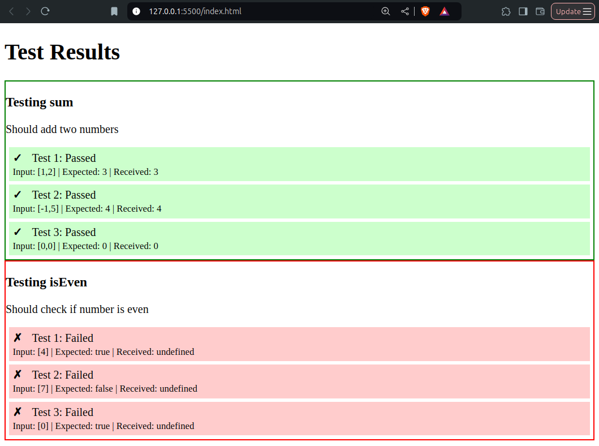

A browser-based JavaScript testing suite without npm dependencies



1. **Directory Structure**:
```
├── index.html
├── solution.js (student's file)
└── tests.js (our test runner)
```

2. **index.html**:
```html
<!DOCTYPE html>
<html>
<head>
    <title>JS Exercise Tests</title>
    <style>
        .test { padding: 5px; margin: 5px; }
        .pass { background: #cfc; }
        .fail { background: #fcc; }
        .status { font-weight: bold; margin-right: 10px; }
    </style>
</head>
<body>
    <h1>Test Results</h1>
    <div id="results"></div>
    
    <!-- Student's solution -->
    <script src="solution.js"></script>
    
    <!-- Test runner -->
    <script src="tests.js"></script>
</body>
</html>
```

3. **tests.js** (Test Runner):
```javascript
// Test configuration
const tests = {
    sum: {
        description: "Should add two numbers",
        tests: [
            { args: [1, 2], expected: 3 },
            { args: [-1, 5], expected: 4 },
            { args: [0, 0], expected: 0 }
        ]
    },
    isEven: {
        description: "Should check if number is even",
        tests: [
            { args: [4], expected: true },
            { args: [7], expected: false },
            { args: [0], expected: true }
        ]
    }
};

// Test runner
function runTests() {
    const resultsDiv = document.getElementById('results');
    
    for (const [funcName, config] of Object.entries(tests)) {
        const testContainer = document.createElement('div');
        testContainer.className = 'test-case';
        testContainer.innerHTML = `<h3>Testing ${funcName}</h3><p>${config.description}</p>`;
        
        let allPassed = true;
        
        config.tests.forEach((testCase, i) => {
            const testElement = document.createElement('div');
            testElement.className = 'test';
            
            try {
                const result = window[funcName](...testCase.args);
                const passed = JSON.stringify(result) === JSON.stringify(testCase.expected);
                
                testElement.innerHTML = `
                    <span class="status">${passed ? '✓' : '✗'}</span>
                    Test ${i + 1}: ${passed ? 'Passed' : 'Failed'}
                    <br>
                    <small>
                        Input: ${JSON.stringify(testCase.args)} 
                        | Expected: ${JSON.stringify(testCase.expected)}
                        | Received: ${JSON.stringify(result)}
                    </small>
                `;
                
                testElement.className += passed ? ' pass' : ' fail';
                allPassed = allPassed && passed;
            } catch (error) {
                testElement.innerHTML = `
                    <span class="status">✗</span>
                    Test ${i + 1} Error: ${error.message}
                `;
                testElement.className += ' fail';
                allPassed = false;
            }
            
            testContainer.appendChild(testElement);
        });
        
        testContainer.style.border = `2px solid ${allPassed ? 'green' : 'red'}`;
        resultsDiv.appendChild(testContainer);
    }
}

// Run tests when page loads
window.addEventListener('load', runTests);
```

4. **solution.js** (Student's Implementation Example):
```javascript
// Student's implementations
function sum(a, b) {
    return a + b;
}

function isEven(num) {
    return num % 2 === 0;
}

// Alternative implementation with different names:
// const addNumbers = (x, y) => x + y;
// window.sum = addNumbers;
```

**How it Works**:

1. Students implement functions with specific names (or alias them to those names)
2. The test runner looks for these function names in the global scope
3. Each test case is executed and results are visually displayed
4. Tests show detailed input/expected/received comparisons
5. Color-coded results make it easy to see passes/failures

**Student Instructions**:
1. Create functions with these exact names:
   - `sum(a, b)`
   - `isEven(num)`
2. If you use different function names, alias them like:
   ```javascript
   window.sum = yourFunctionName;
   window.isEven = yourOtherFunction;
   ```
3. Open index.html in a browser to see test results

**Key Features**:
- Pure JavaScript (no dependencies)
- Real-time browser results
- Detailed error reporting
- Input/expected/received comparisons
- Error handling for crashes
- Color-coded visual feedback

This solution provides immediate feedback while maintaining flexibility for different implementations. The visual presentation helps students quickly identify which tests passed/failed and why.